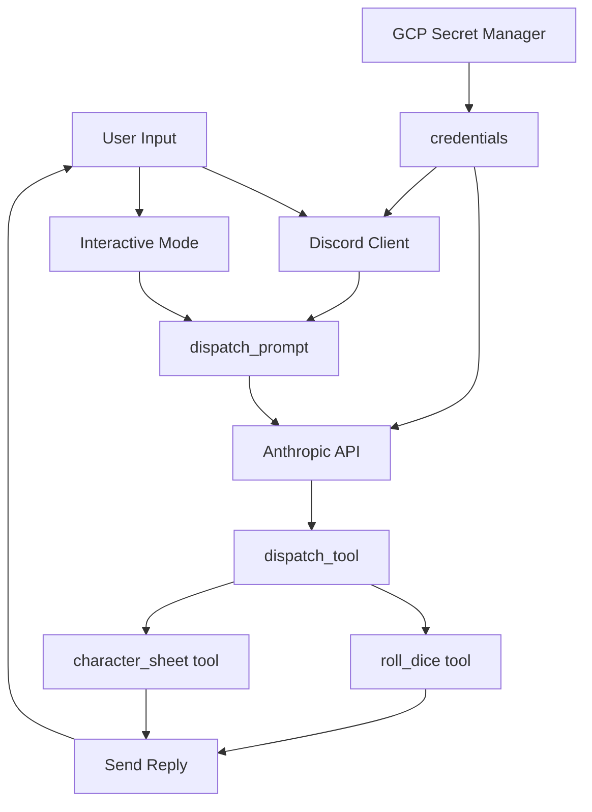

# AGENTS.md

This document provides guidance for AI agents working on the Avandra D&D chat bot codebase.

## Project Overview

Avandra is a D&D 5e chat bot that helps players roll dice using their character sheets. The bot integrates with Discord and uses the Anthropic Claude API to understand player requests and execute dice rolling tools. The bot acts as the goddess Avandra, patron deity of luck and adventure, helping run D&D campaigns.

## Architecture

The application follows an async, event-driven architecture with clear separation between API integrations (backends), tool implementations, and core application logic.



## Directory Structure

### `app/backends/`
Contains API integration clients:
- **`anthropic.py`**: Anthropic Claude API client with async message handling and tool calling support
- **`discord.py`**: Discord bot client that listens for messages and triggers bot responses
- **`gcp.py`**: Google Cloud Platform Secret Manager integration for secure credential storage

### `app/tools/`
Contains tool implementations that the AI can call:
- **`roll_dice.py`**: Dice rolling tool with emoji support for Discord
- **`character_sheet.py`**: Character sheet lookup and management (currently in-memory storage)

### `app/`
Core application logic:
- **`main.py`**: Entry point supporting both Discord and interactive modes
- **`dispatch_prompt.py`**: Handles user prompts, constructs system prompts, and routes to Anthropic API
- **`dispatch_tool.py`**: Routes tool calls from Anthropic API to appropriate tool implementations
- **`credentials.py`**: Manages API keys and tokens (environment variables or GCP Secret Manager)

## Coding Conventions

### Code Formatting
- **Use Black formatter for all Python code**
- Black automatically handles line breaks and formatting
- Run `black .` to format the codebase
- Black's default line length is 88 characters, but can be configured if needed

### Code Linting
- **Use pylint for static code analysis**
- Run `pylint app/` to lint the codebase
- Configuration is in `.pylintrc` at the project root
- Pylint checks for code quality, potential bugs, and style issues
- Run pylint before committing code changes

### Async/Await
- **All I/O operations must use `async`/`await`**
- The entire application is built on asyncio
- Use `asyncio.to_thread()` for CPU-bound operations that need to run in a thread pool
- Example from `app/backends/anthropic.py`:
  ```python
  async def call_api(self, ...):
      return await asyncio.to_thread(
          self.client.messages.create,
          ...
      )
  ```

### Type Hints
- **Type hints are required for all function signatures**
- Use `typing` module for complex types (e.g., `Callable`, `Awaitable`)
- Use `|` for union types (Python 3.10+), e.g., `dict | str`
- Example:
  ```python
  async def handle_tool(
      tool_name: str,
      input: dict | str,
      send_reply: Callable[[str], Awaitable[None]],
  ) -> str:
  ```

### Pydantic Models
- **Use Pydantic v2 models for all data validation**
- Use `BaseModel` with `ConfigDict(strict=True)` for strict validation
- Use `Annotated` with `Field` for field descriptions and constraints
- Use `model_json_schema()` to generate tool schemas for Anthropic API
- Example from `app/tools/roll_dice.py`:
  ```python
  class DiceRollInput(BaseModel):
      model_config = ConfigDict(strict=True)
      sides: Annotated[int, Field(description="...", ge=1)]
  ```

### Tool Implementation Pattern
Every tool in `app/tools/` must implement:

1. **Input Model**: A Pydantic `BaseModel` for input validation
2. **Main Function**: An async function that performs the tool's action
3. **`tool_json_schema()`**: Returns the JSON schema for Anthropic API
4. **`run()`**: Entry point that validates input and calls the main function

Example structure:
```python
class ToolInput(BaseModel):
    model_config = ConfigDict(strict=True)
    # ... fields with Field() annotations

async def tool_function(
    input: ToolInput,
    send_reply: Callable[[str], Awaitable[None]]
) -> str:
    """Tool description for Anthropic API."""
    # Implementation
    await send_reply("Tool output")
    return json_result

def tool_json_schema() -> dict:
    return {
        "name": "tool_name",
        "description": tool_function.__doc__,
        "input_schema": ToolInput.model_json_schema(),
    }

async def run(
    input: dict | str,
    send_reply: Callable[[str], Awaitable[None]]
) -> str:
    if isinstance(input, str):
        inputs = ToolInput.model_validate_json(input)
    else:
        inputs = ToolInput.model_validate(input)
    return await tool_function(inputs, send_reply)
```

## Adding New Tools

To add a new tool:

1. **Create a new file** in `app/tools/` (e.g., `app/tools/my_tool.py`)

2. **Define the input model**:
   ```python
   from pydantic import BaseModel, ConfigDict, Field
   from typing import Annotated
   
   class MyToolInput(BaseModel):
       model_config = ConfigDict(strict=True)
       param: Annotated[str, Field(description="...", min_length=1)]
   ```

3. **Implement the tool function**:
   ```python
   async def my_tool(
       input: MyToolInput,
       send_reply: Callable[[str], Awaitable[None]]
   ) -> str:
       """Tool description."""
       await send_reply("Tool output")
       return json_result
   ```

4. **Add `tool_json_schema()` and `run()` functions** (see pattern above)

5. **Register the tool** in `app/dispatch_prompt.py`:
   ```python
   tool_list = [
       tools.character_sheet.tool_json_schema(),
       tools.roll_dice.tool_json_schema(),
       tools.my_tool.tool_json_schema(),  # Add here
   ]
   ```

6. **Register the handler** in `app/dispatch_tool.py`:
   ```python
   match tool_name:
       case "my_tool":
           return await tools.my_tool.run(input, send_reply)
   ```

## Adding New Backends

To add a new backend API integration:

1. **Create a new file** in `app/backends/` (e.g., `app/backends/my_api.py`)

2. **Implement the client class** with async methods:
   ```python
   class MyAPIClient:
       def __init__(self, api_key: str):
           self.client = MyAPIClient(api_key=api_key)
       
       async def call_api(self, ...):
           return await asyncio.to_thread(self.client.method, ...)
   ```

3. **Add credential management** in `app/credentials.py`:
   ```python
   def my_api_key() -> str:
       if key := os.getenv("MY_API_KEY"):
           return key
       return gcp.get_my_api_key()
   ```

4. **Add GCP secret retrieval** in `app/backends/gcp.py` if needed:
   ```python
   @memoize
   def get_my_api_key() -> str:
       return _get_secret(PROJECT_ID, "my-api-key")
   ```

## Key Patterns

### Tool Registration Pattern
Tools are registered in two places:
1. **`app/dispatch_prompt.py`**: Added to `tool_list` for Anthropic API schema
2. **`app/dispatch_tool.py`**: Added to `match` statement for routing

### Async Callback Pattern
Tools receive a `send_reply` callback to send intermediate messages:
```python
async def tool(
    input: ToolInput,
    send_reply: Callable[[str], Awaitable[None]]
) -> str:
    await send_reply("Processing...")
    # ... do work
    await send_reply("Done!")
    return json_result
```

### System Prompt Construction
System prompts are built in `app/dispatch_prompt.py`:
- Base prompt describes Avandra's role
- Character-specific prompts are added if a character sheet exists
- Character prompts use `cache_control: { "type": "ephemeral" }` to avoid caching

### Character Sheet Lookup
Character sheets are currently stored in-memory in `app/tools/character_sheet.py`:
- Dictionary keyed by character name
- TODO: Migrate to database (see `init_db.sql` for schema)
- Character names are mapped from Discord usernames in `app/backends/discord.py`

### Tool Calling Flow
1. User sends message → Discord client or interactive mode
2. `dispatch_prompt.handle_prompt()` constructs system prompt and tool list
3. `AnthropicClient.call()` sends to Claude API
4. Claude responds with tool calls in message content
5. `dispatch_tool.handle_tool()` routes to appropriate tool
6. Tool executes and returns JSON result
7. Result is sent back to Claude API for final response
8. Final response sent to user via `send_reply`

## Testing

### Mock Clients
- **`MockAnthropicClient`**: Available in `app/backends/anthropic.py` for testing
- Uses `mock_call_api()` to return predefined responses
- Useful for testing tool implementations without API calls

### Testing Pattern
```python
# Use mock client for testing
client = MockAnthropicClient(api_key="test")
message = client.mock_call_api()
# Verify tool calls in message.content
```

## Dependencies

Key libraries and their usage:

- **`anthropic`**: Anthropic Claude API client
- **`discord.py`**: Discord bot framework (v2.5.0+)
- **`pydantic`** (v2.7.0+): Data validation and serialization
  - Use `pydantic_core` for low-level JSON operations (`from_json`, `to_json`)
- **`google-cloud-secret-manager`**: GCP Secret Manager for credentials
- **`psycopg[binary]`**: PostgreSQL adapter (for future database migration)
- **`asyncio`**: Built-in async/await support

## Important Notes

### Character Sheet Storage
- Currently stored in-memory dictionary in `app/tools/character_sheet.py`
- Database schema exists in `init_db.sql` but not yet integrated
- Character sheets should be migrated to database when implementing persistence

### Emoji System
- Dice rolls use Discord custom emojis for visual representation
- Emoji IDs are hardcoded in `app/tools/roll_dice.py`
- Only supports d4, d6, and d20 dice visually; others show as numbers

### Credential Management
- Credentials checked in order: environment variables → GCP Secret Manager
- Environment variables: `DISCORD_TOKEN`, `ANTHROPIC_KEY`
- GCP secrets: `discord-token`, `anthropic-key`, `porygon-password`
- All GCP secret access is memoized to minimize API calls

### Model Configuration
- Currently using `claude-4-5-haiku-latest` (see `app/backends/anthropic.py`)
- Model can be changed by uncommenting different model strings
- `max_tokens=1024` limits response length

### Error Handling
- Tool errors are caught and returned as error messages
- Errors are sent via `send_reply` callback
- Tool results include error information for Claude to handle gracefully
